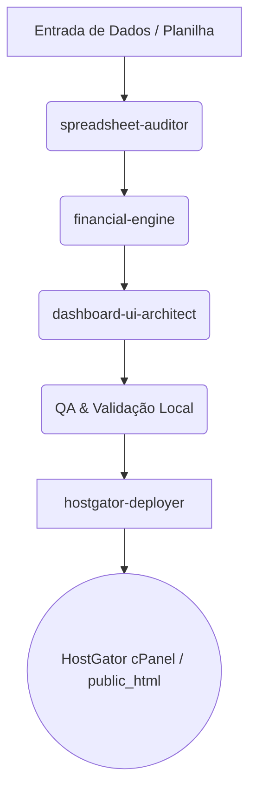

# 🤖 AGENTS.md — Financial Web Operating System & Scalability Guide

Este documento define o framework de agentes autônomos e especializados responsáveis pela operação, manutenção contínua, evolução de cálculos financeiros e deploy na **HostGator** do Dashboard Financeiro de Victor.

---

## 🎯 Objetivo do Sistema
Transformar e manter o ecossistema da planilha `Victor Orçamento Anual.xlsx` em uma aplicação web de alta performance, visualmente sofisticada, 100% responsiva e com cálculos financeiros de precisão absoluta (receitas, despesas fixas, despesas variáveis, investimentos, cartões, metas e comparativos anuais), preparada para hospedagem estática/PHP na HostGator (cPanel / Apache / HTTPS).

---

## 👥 Agentes Especialistas

### 1. 🔍 Agent: `spreadsheet-auditor` (Auditoria & Regras de Negócio)
- **Missão**: Analisar atualizações na planilha Excel original (`Victor Orçamento Anual.xlsx`) ou novas planilhas adicionadas.
- **Competências**:
  - Mapear intervalos de células (`C4:C14` receitas, `C17:C34` fixas, `C38:C49` variáveis, `C54:C56` investimentos, etc.).
  - Preservar a matemática e regras de proporção (`C35/C15`, `C50/C15`, `C57/C15`).
  - Atualizar o `data_schema.json` e notificar o desenvolvedor de cálculos.

### 2. 🧮 Agent: `financial-engine` (Motor Matemático & Cálculos)
- **Missão**: Garantir integridade matemática em JavaScript puro sem arredondamentos errôneos.
- **Fórmulas Centrais**:
  - `Total Receitas`: $\sum(R_1..R_n)$
  - `Despesas Essenciais/Fixas`: $\sum(D_{fixas})$ e $\% \text{ Receita} = \frac{D_{fixas}}{Receita}$
  - `Despesas Variáveis/Estilo de Vida`: $\sum(D_{variaveis})$ e $\% \text{ Receita} = \frac{D_{variaveis}}{Receita}$
  - `Investimentos & Reserva`: $\sum(Inv)$ e $\% \text{ Investida} = \frac{Inv}{Receita}$
  - `Sobra Líquida Mensal`: $\text{Receitas} - \text{Fixas} - \text{Variáveis} - \text{Investimentos}$
  - `Consolidação de Cartão`: Agrupamento por vencimento, categoria, parcelas e totalização.
  - `Metas & Desejos`: Cálculo de progresso percentual, contagem de itens concluídos (`COUNTIF / COUNTA`).

### 3. 🎨 Agent: `dashboard-ui-architect` (Experiência Visual & Frontend)
- **Missão**: Fornecer interface espetacular (Glassmorphism, Dark Mode refinado, Paleta Ouro/Esmeralda/Grafite, Tipografia moderna como Inter/Outfit, Micro-interações táteis).
- **Competências**:
  - Layout dividido em abas modulares:
    1. **Visão Geral & Orçamento 2026/2027**: Resumo dinâmico mês a mês, gráficos de barras e fluxo de caixa.
    2. **Lançamentos Rápidos**: Inserção simples de novas despesas e receitas com categorização automática.
    3. **Cartão de Crédito**: Gestão da fatura (ex: Agosto e próximos meses) com discriminativo de compras.
    4. **Investimentos**: Patrimônio atual, metas de aporte e rentabilidade.
    5. **Metas & Desejos**: Checklist interativo com filtros de concluído/pendente e barras de progresso.
    6. **Comparativo Anual**: Visão macro multi-anos (2024, 2026, 2027).
    7. **Configurações & Backup**: Exportação/Importação de JSON, reset e sincronização.

### 4. 🌐 Agent: `hostgator-deployer` (DevOps & Hospedagem)
- **Missão**: Preparar, validar e empacotar a aplicação para o ambiente Apache/cPanel da HostGator.
- **Diretrizes de Produção**:
  - Estrutura estática `public_html` (index.html, css/, js/, assets/).
  - Arquivo `.htaccess` pré-configurado com compressão Gzip/Brotli, cache headers (Cache-Control), redirecionamento HTTPS forçado e proteção contra listagem de diretórios (`Options -Indexes`).
  - Compatibilidade com subdomínios (ex: `financeiro.seudominio.com.br`) ou pastas (`seudominio.com.br/financeiro/`).

---

## 🛠️ Ciclo Operacional & Escalabilidade

1. **Adição de Novos Gastos**: Feita diretamente no site via interface simplificada ou importação de CSV/Excel.
2. **Persistência**: Armazenamento local via `localStorage` com suporte a download instantâneo de backup `.json`.
3. **Escalabilidade**: Modularidade de scripts (`app.js`, `calculations.js`, `charts.js`, `storage.js`).
